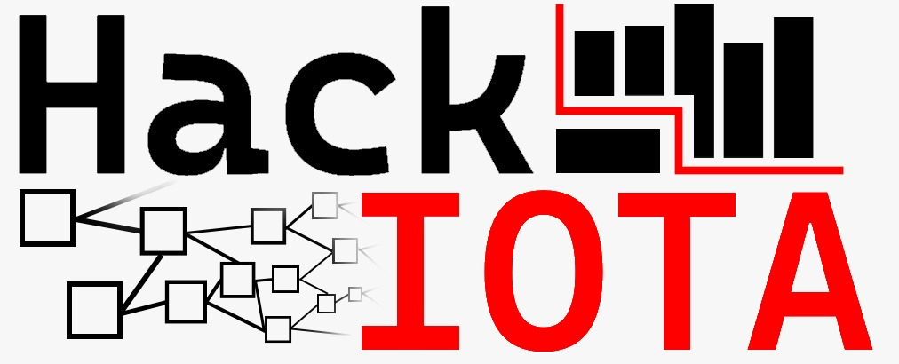

# hackIOTA

*Participatory collection of sensor data, stored on the IOTA tangle with easily obtainable devices.*

### Short Description

Our goal is the broad and participatory collection of environmental data of our surroundings,
incentivising and protecting measurements by using the IOTA tangle combined with easily accessible sensor devices.

### Introduction

This repository documents the progress of team hackIOTA participating at the Participatory Resilience Hackathon at ETHZ, 2022. The team aims to combine an air quality sensor with the IOTA tangle, a distributed ledger technology that was designed for seamless integration of Internet of Things (IoT) devices. The IOTA Tangle provides an ideal location for sensor measurements to be stored such that measurements are:

- secure,
- immutable,
- accessible.

For Example:

### Repositories

The following repositories collect the code we put together:

- Raspberri Pi Sensor Readings set to API: https://github.com/DouglasBrennan/environment_sensor.git

- API receives Sensor Readings and publishes to Tangle: https://github.com/DouglasBrennan/hackIota.git

- Visualizations of Live Measurements from the Tangle: https://github.com/shivus123/mapiota

### Resources

Tangle developer nodes for testings purposes (devnet) can be found at: http://wiki.iota.org/introduction/reference/networks/devnet

iota-client use resources: https://wiki.iota.org/iota.rs/explanations/address_key_space

### Future Work

Furthermore, the IOTA Tangle, leveraging cryptocurrency transactions, can be used to incentivize workers to take measurements that provide high quality of service, and informative sensor readings.

Mobile crowd sensing (MCS) is the process by which a network of sensing entities is used to sample an environment. Multi-Armed Bandit (MAB) algorithms are proposed for requesters to learn to pick the sensing entities (workers) such that certain metrics are optimised over time. In the language of reinforcement learning, such that regret is minimized. 

For example, a requester may wish to minimize its utilized resources to sample N datapoints from a sensor network covering the city of Zurich. In the city of Zurich there are M sensors where each sensor reading has a cost of 1 to the requester. The requester must decide which of the M sensors to sample from and this problem can be formulated as a MAB when these readings are repeated over time, and as the requester learns which sensors provide the best readings. 

In [@xiong2015crowdtasker] the data quality is based on the reliability of the worker, how likely it is that the worker will accept the measurement request. In [@wu2019context], the MAB algorithm is extended with knowledge about a workers extrinsic ability, and intrinsic ability such that decisions can be made more effectively by the requester. 

We suggest investigation of a novel manner to evaluate measurement quality that is not based solely on the reliability of the workers, but also on the history of measurements from those workers, and in correlated areas. The goal of a requester could be to maximize the informativeness of the sensor readings rather than the quality of the information alone. For example, a sensor measurement which stays constant for most of the day, year round, is not a very informative sensor. Therefore, a requester may wish to sample less frequently from such a sensor. On the other hand, a sensor which varies frequently a day provides a more informative measurement. A requester may wish to sample from this sensor more frequently to keep up with the changes.

Such reasoning comes down to the entropies of the observed distributions. A requester wishing to maximize informativeness can also try to maximize entropy. 

### References

Wu, Yue, et al. "A context-aware multiarmed bandit incentive mechanism for mobile crowd sensing systems." *IEEE Internet of Things Journal* 6.5 (2019): 7648-7658.

1. [8]  T. Li *et al.*, “Scalable privacy-preserving participant selection in mobile

   crowd sensing,” in *Proc. IEEE PerCom*, 2017, pp. 59–68.

2. [9]  H. To, G. Ghinita, and C. Shahabi, “A framework for protecting worker location privacy in spatial crowdsourcing,” *Proc. VLDB Endowment*,

   vol. 7, no. 10, pp. 919–930, 2014.

3. [10]  H. Xiong, D. Zhang, G. Chen, L. Wang, and V. Gauthier, “CrowdTasker:

   Maximizing coverage quality in piggyback crowdsensing under budget

   constraint,” *ACM Trans. Intell. Syst. Technol.*, vol. 6, no. 3, p. 39, 2015.

4. [11]  D. Zhang, H. Xiong, L. Wang, and G. Chen, “CrowdRecruiter: Selecting participants for piggyback crowdsensing under probabilistic coverage

   constraint,” in *Proc. ACM UbiComp*, 2014, pp. 703–714.

5. [12]  H. Li, T. Li, and Y. Wang, “Dynamic participant recruitment of mobile crowd sensing for heterogeneous sensing tasks,” in *Proc. MASS*, Dallas,

   TX, USA, 2015, pp. 136–144.

6. [13]  X. Wang *et al.*, “Incentivizing crowdsensing with location-privacy

   preserving,” *IEEE Trans. Wireless Commun.*, vol. 16, no. 10,

   pp. 6940–6952, Oct. 2017.

7. [14]  H. Li, T. Li, F. Li, S. Yang, and Y. Wang, “Multi-expertise aware par-

   ticipant selection in mobile crowd sensing via online learning,” in *Proc.*

   *IEEE MASS*, Chengdu, China, 2018, pp. 433–441.

8. [15]  Y. Wang, D. Xu, and F. Li, “Providing location-aware location privacy

   protection for mobile location-based services,” *Tsinghua Sci. Technol.*,

   vol. 21, no. 3, pp. 243–259, Jun. 2016.

9. [16]  L. Cheng, C. Chen, J. Ma, and Y. Chen, “A group-level incentive scheme

   for data collection in wireless sensor networks,” in *Proc. IEEE CCNC*,

   Las Vegas, NV, USA, 2009, pp. 1–5.

10. [17]  H. Li, T. Li, F. Li, W. Wang, and Y. Wang, “Enhancing participant selec-

    tion through caching in mobile crowd sensing,” in *Proc. IEEE IWQoS*, Beijing, China, 2016, pp. 1–10.
